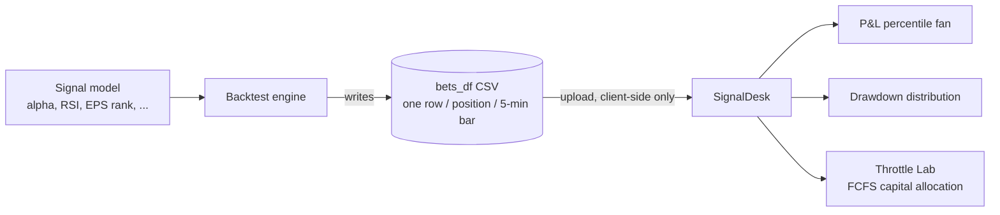

# SignalDesk

A visual analyzer for quarterly `bets_df` files. Upload a 5-minute position CSV and understand what actually drove your portfolio — which signals a capital-limited desk would have taken, which it would have skipped, and what those choices cost.

SignalDesk is **not** a recommendation engine. It never ranks signals, never looks ahead, and never optimizes. It shows you the consequences of realistic constraints applied to your own model's output.

> **About this public version.** I built SignalDesk during a software-engineering internship on a quantitative trading desk, where it analyzed real quarterly position files from the desk's backtesting pipeline. Those files are proprietary, so this repo ships with a **fully synthetic sample dataset** instead — 130 fictional positions over a fictional quarter, generated by [`scripts/generate_sample_data.py`](scripts/generate_sample_data.py) to match the exact shape of the real files (India-session 5-minute bars, multi-day holds, stop-loss exits, entry signals). Everything else — parser, analytics, throttle, charts — is exactly what ran on the desk.

## Try it in 30 seconds

**Live demo:** [signaldesk-nu.vercel.app](https://signaldesk-nu.vercel.app) — click **“No file handy? Try the synthetic sample”** on the upload screen.

Or run it locally:

```bash
git clone https://github.com/jayant-nagpal/signaldesk.git
cd signaldesk && npm install && npm run dev
```

35k rows parse in ~350ms and every view lights up. To regenerate the sample with different characteristics:

```bash
python scripts/generate_sample_data.py   # needs numpy
```

## What it does

### Portfolio Overview
- **KPI strip** — positions, win rate, median/avg net return, median max drawdown, stop-loss count, date range
- **Cumulative return path** — median with P25–P75 and P10–P90 percentile fans across all 5-min intervals
- **Max drawdown distribution** — per-position peak-to-trough histogram
- **Sector breakdown** — win rate, returns, drawdown by sector
- **Position drill-down** — click any position for its full 5-min path, interval returns, and entry signals

### Throttle Lab
A first-come-first-serve throttle that mimics how a human desk with limited capital actually trades:

- **Concurrent position slots** — a signal is accepted only if a slot is free the moment it arrives. Slots free up when positions exit (actual exit times from the file). Signals arriving while all slots are full are skipped — permanently.
- **Entry time window** — only take signals arriving within a chosen time-of-day range
- **Sector exclusion** — remove sectors before the FCFS pass begins
- **Capital in play** — open positions over the quarter vs. the slot cap
- **Cap sweep (scenario analysis)** — hindsight-only curve of net contribution at every possible cap, with current and best cap marked
- **Accepted / Skipped tables** — every decision, in arrival order, with what the skipped signals went on to do

All transaction costs and position weights come from the file as-is. Nothing is assumed or simulated.

### Market detection
The app infers the market from intraday bar-time fingerprints — India (09:15–15:30 IST), US (09:30–16:00 ET, including Pacific-stamped feeds), Taiwan (09:00–13:30 TST) — and shows a flag badge in the top bar. Unrecognized sessions are labeled honestly rather than guessed.

## Data format

A quarterly `bets_df` CSV with one row per position per 5-minute bar. Required columns:

| Column | Meaning |
|---|---|
| `osid` | position identifier |
| `trade_date` | 5-min bar timestamp |
| `days_held` | bar sequence number within the position |
| `cum_return` | cumulative return at that bar |
| `bet_final_return` | final gross return of the position |
| `est_tc` | estimated transaction cost |
| `bet_open_weight` | position weight at entry |
| `bet_open_date` / `bet_close_date` | entry / exit timestamps |
| `sector_group` | sector code (1–11) |
| `exit_type` | exit reason (−1 = stop-loss) |

Entry-signal columns (`alpha`, `beta`, `rsi`, `rlst`, `hotness`, EPS rank, price vs EMA/SMA, etc.) are shown in the drill-down when present.

Everything runs client-side — the file never leaves your browser. A 237k-row quarter parses in ~1 second.

## Where the file comes from (the original pipeline)

This app is the analysis layer on top of a desk's backtesting pipeline — it
doesn't run the backtest itself, it explains what already happened in one.



On the desk, a signal model scores every candidate position each session; a
backtest engine walks the quarter and, for every position it would have taken,
writes one row per 5-minute bar to a `bets_df` file — entry signals, running
return, exit reason. SignalDesk reads that file and answers the questions the
raw numbers don't: which signals a **capital-limited** desk (finite number of
slots, first-come-first-served) would actually have been able to take, which
it would have had to skip, and — via the Throttle Lab — what those skipped
signals went on to do. Nothing here re-runs or second-guesses the model; it's
purely a lens on the model's own output.

## Run it locally

```bash
git clone https://github.com/jayant-nagpal/signaldesk.git
cd signaldesk
npm install
npm run dev
```

Open the printed localhost URL, drop in a `bets_df` CSV — or use the built-in synthetic sample.

Production build: `npm run build` (output in `dist/`, deployable to any static host).

## Stack

React 19 + TypeScript + Vite, Recharts for charts, plain CSS. No backend, no state libraries, no storage — everything is computed in memory from the uploaded file.

## Known limitations (by design, for now)

- Portfolio contribution uses entry weights × final returns; it does not re-mark positions bar-by-bar
- One file at a time — no cross-quarter comparison yet
- The cap sweep is pure hindsight and is labeled as such; the throttle itself never looks ahead
- No benchmark overlay in the throttle view
